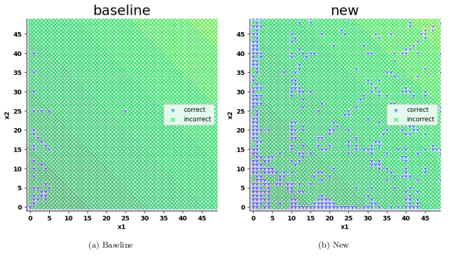
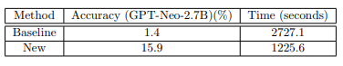
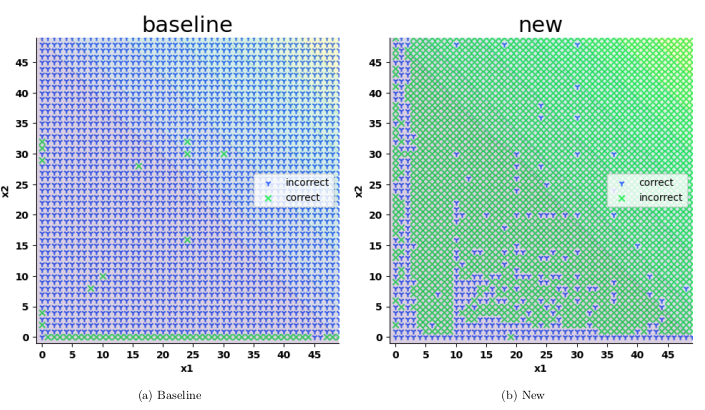
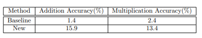
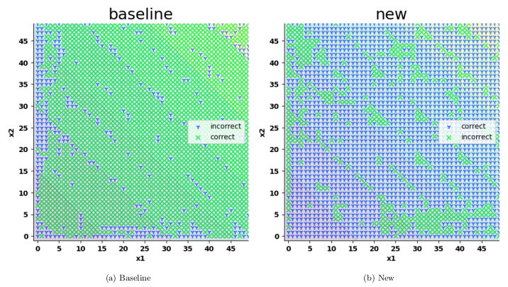
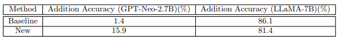

# CalcGPT
Comparative performance analysis of different Large Language Models to perform simple mathematical calculations 

## Method for encoding strings
#### Baseline encoding 
x1 + x2 = is passed to the model.
#### New method encoding 
A prefix is added as a context hint: You are a calculator. Please calculate: 1 + 2 = 3, 3 + 4 = 7, 11 + 32 = 43, x1 + x2 =

## Performance comparison for addition using GPT-Neo-2.7B (Baseline vs New method)

  

  

## Performance comparison for addition and multiplication using GPT-Neo-2.7B (Baseline vs New method)

  

  

##  Comment on the results

GPT-Neo-2.7B seems not to generate random results,
since for the new method, between 0-5, it can predicts correct results. Even, when, both of the operands are same, a
significant number of cases are found to be correct in case of new method.
Given context like: Please calculate/please find the sum of with a few examples in the prompt have significantly increased
the accuracy. On the other hand, for baseline, it seems that it is generating either randomly or has some memorized data
source which results in 1.4% accuracy.

## Performance comparison for addition using GPT-Neo-2.7B and LLaMA-7B (Baseline vs New method)

  

  

## Comments for LLaMA
LLaMA-7B is found to be significantly performant for adding numbers within the range 0-50. Even, without given context
(New method), it provides 86.1% accuracy.
